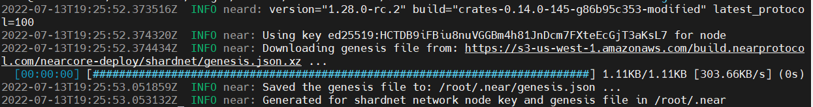

# Stake Wars: Episode III. Challenge 001
* Published on: 2022-07-13
* Updated on: 2022-07-13
* Submitted by: Open Shards Alliance

Create your Shardnet wallet, deploy your node, and correctly configure your staking pool.
This is designed to be your very first challenge: use it to understand how the staking on NEAR works, and how to run a node.


## Usefull links

Wallet: https://wallet.shardnet.near.org/

Explorer: https://explorer.shardnet.near.org/ 


### 1. Setup NEAR-CLI

NEAR-CLI is a command-line interface that communicates with the NEAR blockchain via remote procedure calls (RPC):

* Setup and Installation NEAR CLI
* View Validator Stats

> Note: For security reasons, it is recommended that NEAR-CLI be installed on a different computer than your validator node and that no full access keys be kept on your validator node.


#### Setup NEAR-CLI

First, let's make sure the Debian machine is up-to-date.
```
sudo apt update && sudo apt upgrade -y
```

##### Install developer tools, Node.js, and npm
First, we will start with installing `Node.js` and `npm`:
```
curl -sL https://deb.nodesource.com/setup_18.x | sudo -E bash -  
sudo apt install build-essential nodejs
PATH="$PATH"
```

Check `Node.js` and `npm` version:
```
node -v
```
> v18.x.x

```
npm -v
```
> 8.x.x


##### Install NEAR-CLI
Here's the Github Repository for NEAR CLI.: https://github.com/near/near-cli. To install NEAR-CLI, unless you are logged in as root, which is not recommended you will need to use `sudo` to install NEAR-CLI so that the near binary is saved to /usr/local/bin

```
sudo npm install -g near-cli
```
### Validator Stats

Now that NEAR-CLI is installed, let's test out the CLI and use the following commands to interact with the blockchain as well as to view validator stats. There are three reports used to monitor validator status:


###### Environment
The environment will need to be set each time a new shell is launched to select the correct network.

Networks:
- GuildNet
- TestNet
- MainNet
- **Shardnet** (this is the network we will use for Stake Wars)

Command:
```
export NEAR_ENV=shardnet
```

#### NEAR CLI Commands Guide:

###### Proposals
A proposal by a validator indicates they would like to enter the validator set, in order for a proposal to be accepted it must meet the minimum seat price.

Command:
```
near proposals
```

###### Validators Current
This shows a list of active validators in the current epoch, the number of blocks produced, number of blocks expected, and online rate. Used to monitor if a validator is having issues.

Command:
```
near validators current
```

###### Validators Next
This shows validators whose proposal was accepted one epoch ago, and that will enter the validator set in the next epoch.

Command:
```
near validators next
```

---


## 2. Setup your validator


Setup a validator and sync it to the actual state of the network. This challenge is focused on having the nearcore running and finding peers to download blocks.
#### Server Requirements
Please see the hardware requirement below:

| Hardware       | Chunk-Only Producer  Specifications                                   |
| -------------- | ---------------------------------------------------------------       |
| CPU            | 4-Core CPU with AVX support                                           |
| RAM            | 8GB DDR4                                                              |
| Storage        | 500GB SSD                                                             |


#### Install required software & set the configuration

##### Prerequisites:
Before you start, you may want to confirm that your machine has the right CPU features. 

```
lscpu | grep -P '(?=.*avx )(?=.*sse4.2 )(?=.*cx16 )(?=.*popcnt )' > /dev/null \
  && echo "Supported" \
  || echo "Not supported"
```
> Supported

Next, let's make sure the Debian machine is up-to-date.
```
sudo apt update && sudo apt upgrade -y
```

##### Install developer tools:
```
sudo apt install -y git binutils-dev libcurl4-openssl-dev zlib1g-dev libdw-dev libiberty-dev cmake gcc g++ python docker.io protobuf-compiler libssl-dev pkg-config clang llvm cargo
```
#####  Install Python pip:

```
sudo apt install python3-pip
```
##### Set the configuration:

```
USER_BASE_BIN=$(python3 -m site --user-base)/bin
export PATH="$USER_BASE_BIN:$PATH"
```

##### Install Building env
```
sudo apt install clang build-essential make
```

##### Install Rust & Cargo
```
curl --proto '=https' --tlsv1.2 -sSf https://sh.rustup.rs | sh
```

You will see the following:


Press 1 and press enter.

##### Source the environment
```
source $HOME/.cargo/env
```

#### Clone `nearcore` project from GitHub
First, clone the [`nearcore` repository](https://github.com/near/nearcore).

```
git clone https://github.com/near/nearcore
cd nearcore
git fetch origin --tags
```

Checkout to the branch you need. Get Latest stable version. Please check the [releases page on GitHub](https://github.com/near/nearcore/releases).

```
git checkout tags/<version> -b mynode
```

#### Compile `nearcore` binary
In the `nearcore` folder run the following commands:

```
make neard
```
The binary path is `target/release/neard`. If you are seeing issues, it is possible that cargo command is not found. Make sure `sudo apt install cargo`. Compiling `nearcore` binary may take a little while.

#### Initialize working directory

In order to work properly, the NEAR node requires a working directory and a couple of configuration files. Generate the initial required working directory by running:

```
./target/release/neard --home ~/.near init --chain-id shardnet --download-genesis
```



This command will create the directory structure and will generate `config.json`, `node_key.json`, and `genesis.json` on the network you have passed. 

- `config.json` - Configuration parameters which are responsive for how the node will work. The config.json contains needed information for a node to run on the network, how to communicate with peers, and how to reach consensus. Although some options are configurable. In general validators have opted to use the default config.json provided.

- `genesis.json` - A file with all the data the network started with at genesis. This contains initial accounts, contracts, access keys, and other records which represents the initial state of the blockchain. The genesis.json file is a snapshot of the network state at a point in time. In contacts accounts, balances, active validators, and other information about the network. 

- `node_key.json` -  A file which contains a public and private key for the node. Also includes an optional `account_id` parameter which is required to run a validator node (not covered in this doc).

- `data/` -  A folder in which a NEAR node will write it's state.

#### Replace the `config.json`

From the generated `config.json`, there two parameters to modify:
- `boot_nodes`: If you had not specify the boot nodes to use during init in Step 3, the generated `config.json` shows an empty array, so we will need to replace it with a full one specifying the boot nodes.
- `tracked_shards`: In the generated `config.json`, this field is an empty empty. You will have to replace it to `"tracked_shards": [0]`

```
rm ~/.near/config.json
wget -O ~/.near/config.json https://s3-us-west-1.amazonaws.com/build.nearprotocol.com/nearcore-deploy/shardnet/config.json
```


#### Run the node
To start your node simply run the following command:

```
cd nearcore
./target/release/neard --home ~/.near run
```


The node is now running you can see log outputs in your console. Your node should be find peers, download headers to 100%, and then download blocks.

----


#####  Create a wallet
https://wallet.shardnet.near.org/


##### Authorize Wallet Locally
A full access key needs to be installed locally to be able transactions via NEAR-CLI.


* You need to run this command:

```
near login
```

> Note: This command launches a web browser allowing for the authorization of a full access key to be copied locally.

1 – Copy the link in your browser


2 – Grant Access to Near CLI


3 – After Grant, you will see a page like this, go back to console


4 – Enter your wallet and press Enter


* Download the latest genesis, config files:

```
cd ~/.near/shardnet
wget -c https://s3-us-west-1.amazonaws.com/build.nearprotocol.com/nearcore-deploy/shardnet/config.json
wget -c https://s3-us-west-1.amazonaws.com/build.nearprotocol.com/nearcore-deploy/shardnet/genesis.json
```

#####  Check the validator_key.json
* Run the following command:
```
cat ~/.near/shardnet/validator_key.json
```


> Note: If a validator_key.json is not present, follow these steps to create one

Create a `validator_key.json` 

*   Generate the Key file:

```
near generate-key <pool_id>
```
* Copy the file generated to shardnet folder:
Make sure to replace <pool_id> by your accountId
```
cp ~/.near-credentials/shardnet/YOUR_WALLET.json ~/.near/shardnet/validator_key.json
```
* Edit “account_id” => xx.pool.near, where xx is your PoolName
* Change `private_key` to `secret_key`

> Note: The account_id must match the staking pool contract name or you will not be able to sign blocks.\

File content must be in the following pattern:
```
{
  "account_id": "xx.pool.near",
  "public_key": "ed25519:HeaBJ3xLgvZacQWmEctTeUqyfSU4SDEnEwckWxd92W2G",
  "secret_key": "ed25519:****"
}
```

#####  Start the node

```
target/release/neard run
```
* Setup Systemd
Command:

```
sudo vi /etc/systemd/system/neard.service
```
Paste:

```[Unit]
Description=NEARd Daemon Service

[Service]
Type=simple
User=<USER>
#Group=near
WorkingDirectory=/home/<USER>/.near
ExecStart=/home/<USER>/nearcore/target/release/neard run
StandardOutput=file:/home/<USER>/.near/neard.log
StandardError=file:/home/<USER>/.near/nearderror.log
Restart=on-failure
RestartSec=30
KillSignal=SIGINT
TimeoutStopSec=45
KillMode=mixed

[Install]
WantedBy=multi-user.target
```

> Note: Change USER to your paths

Command:

```
sudo systemctl enable neard
```
Command:

```
sudo systemctl start neard
```
If you need to make a change to service because of an error in the file. It has to be reloaded:

```
sudo systemctl reload neard
```
###### Watch logs
Command:

```
journalctl -n 100 -f -u neard
```
Make log output in pretty print

Command:

```
sudo apt install ccze
```
View Logs with color

Command:

```
journalctl -n 100 -f -u neard | ccze -A
```
#### Becoming a Validator
In order to become a validator and enter the validator set, a minimum set of success criteria must be met.

* The node must be fully synced
* The `validator_key.json` must be in place
* The contract must be initialized with the public_key in `validator_key.json`
* The account_id must be set to the staking pool contract id
* There must be enough delegations to meet the minimum seat price. See the seat price [here](https://explorer.shardnet.near.org/nodes/validators).
* A proposal must be submitted by pinging the contract
* Once a proposal is accepted a validator must wait 2-3 epoch to enter the validator set
* Once in the validator set the validator must produce great than 90% of assigned blocks

Check running status of validator node. If “Validator” is showing up, your pool is selected in the current validators list.


## 3. Mounting an staking pool

NEAR uses a staking pool factory with a whitelisted staking contract to ensure delegators’ funds are safe. In order to run a validator on NEAR, a staking pool must be deployed to a NEAR account and integrated into a NEAR validator node. Delegators must use a UI or the command line to stake to the pool. A staking pool is a smart contract that is deployed to a NEAR account.

#### Deploy a Staking Pool Contract
##### Deploy a Staking Pool
Calls the staking pool factory, creates a new staking pool with the specified name, and deploys it to the indicated accountId.

```
near call poolv1.near create_staking_pool '{"staking_pool_id": "<pool id>", "owner_id": "<accountId>", "stake_public_key": "<public key>", "reward_fee_fraction": {"numerator": 5, "denominator": 100}}' --accountId="<accountId>" --amount=30 --gas=300000000000000
```

From the example above, you need to replace:

* **Pool ID**: Staking pool name, the factory automatically adds its name to this parameter, creating {pool_id}.{staking_pool_factory}
Examples:   

- `stakewars.near`

* **Owner ID**: The NEAR account that will manage the staking pool. Usually your main NEAR account.
* **Public Key**: The public key in your **validator_key.json** file.
* **5**: The fee the pool will charge (e.g. in this case 5 over 100 is 5% of fees).
* **Account Id**: The NEAR account deploying the staking pool.

> Be sure to have at least 30 NEAR available, it is the minimum required for storage.

To change the pool parameters, such as changing the amount of commission charged to 1% in the example below, use this command:
```
near call <pool_name> update_reward_fee_fraction '{"reward_fee_fraction": {"numerator": 1, "denominator": 100}}' --accountId <account_id> --gas=300000000000000
```


You will see something like this:


If there is a “True” at the End. Your pool is created.

**You have now configure your Staking pool.**


#### Transactions Guide
##### Deposit and Stake NEAR

Command:
```
near call <staking_pool_id> deposit_and_stake --amount <amount> --accountId <accountId> --gas=300000000000000
```
##### Unstake NEAR
Amount in yoctoNEAR.

Run the following command to unstake:
```
near call <staking_pool_id> unstake '{"amount": "<amount yoctoNEAR>"}' --accountId <accountId> --gas=300000000000000
```
To unstake all you can run this one:
```
near call <staking_pool_id> unstake_all --accountId <accountId> --gas=300000000000000
```
##### Withdraw

Unstaking takes 2-3 epochs to complete, after that period you can withdraw in YoctoNEAR from pool.

Command:
```
near call <staking_pool_id> withdraw '{"amount": "<amount yoctoNEAR>"}' --accountId <accountId> --gas=300000000000000
```
Command to withdraw all:
```
near call <staking_pool_id> withdraw_all --accountId <accountId> --gas=300000000000000
```

##### Ping
A ping issues a new proposal and updates the staking balances for your delegators. A ping should be issued each epoch to keep reported rewards current.

Command:
```
near call <staking_pool_id> ping '{}' --accountId <accountId> --gas=300000000000000
```
Balances
Total Balance
Command:
```
near view <staking_pool_id> get_account_total_balance '{"account_id": "<accountId>"}' --gas=300000000000000
```
##### Staked Balance
Command:
```
near view <staking_pool_id> get_account_staked_balance '{"account_id": "<accountId>"}'
```
##### Unstaked Balance
Command:
```
near view <staking_pool_id> get_account_unstaked_balance '{"account_id": "<accountId>"}'
```
##### Available for Withdrawal
You can only withdraw funds from a contract if they are unlocked.

Command:
```
near view <staking_pool_id> is_account_unstaked_balance_available '{"account_id": "<accountId>"}'
```
##### Pause / Resume Staking
###### Pause
Command:
```
near call <staking_pool_id> pause_staking '{}' --accountId <accountId>
```
###### Resume
Command:
```
near call <staking_pool_id> resume_staking '{}' --accountId <accountId>
```

## 4. Monitor and make alerts 

An email notification can make it more comfortable to maintain a validator up and running. Achieve to be a validator confirming transactions on testnet and get >95% of uptime.

#### Log Files
The log file is stored either in the ~/.nearup/logs directory or in systemd depending on your setup.

NEARUp Command:
```
nearup logs --follow
```

Systemd Command:
```
journalctl -n 100 -f -u neard | ccze -A
```

**Log file sample:**

Validator | 1 validator

```
INFO stats: #85079829 H1GUabkB7TW2K2yhZqZ7G47gnpS7ESqicDMNyb9EE6tf Validator 73 validators 30 peers ⬇ 506.1kiB/s ⬆ 428.3kiB/s 1.20 bps 62.08 Tgas/s CPU: 23%, Mem: 7.4 GiB
```

* **Validator**: A “Validator” will indicate you are an active validator
* **73 validators**: Total 73 validators on the network
* **30 peers**: You current have 30 peers. You need at least 3 peers to reach consensus and start validating
* **#46199418**: block – Look to ensure blocks are moving

#### RPC
Any node within the network offers RPC services on port 3030 as long as the port is open in the nodes firewall. The NEAR-CLI uses RPC calls behind the scenes. Common uses for RPC are to check on validator stats, node version and to see delegator stake, although it can be used to interact with the blockchain, accounts and contracts overall.

Find many commands and how to use them in more detail here:

https://docs.near.org/docs/api/rpc


Command:
```
sudo apt install curl jq
```
###### Common Commands:
####### Check your node version:
Command:
```
curl -s http://127.0.0.1:3030/status | jq .version
```
####### Check Delegators and Stake
Command:
```
near view <your pool>.stake.guildnet get_accounts '{"from_index": 0, "limit": 10}' --accountId <accountId>.guildnet
```
####### Check Reason Validator Kicked
Command:
```
curl -s -d '{"jsonrpc": "2.0", "method": "validators", "id": "dontcare", "params": [null]}' -H 'Content-Type: application/json' https://rpc.openshards.io | jq -c ".result.prev_epoch_kickout[] | select(.account_id | contains ("<POOL_ID>"))" | jq .reason
```
####### Check Blocks Produced / Expected
Command:
```
curl -s -d '{"jsonrpc": "2.0", "method": "validators", "id": "dontcare", "params": [null]}' -H 'Content-Type: application/json' http://localhost:3030/ | jq -c ".result.current_validators[] | select(.account_id | contains ("POOL_ID"))"
``

## Update log

Updated 2022-07-13: Creation

Updated 2022-07-13: Creation
