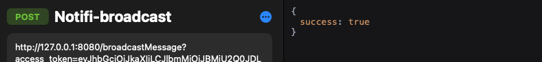
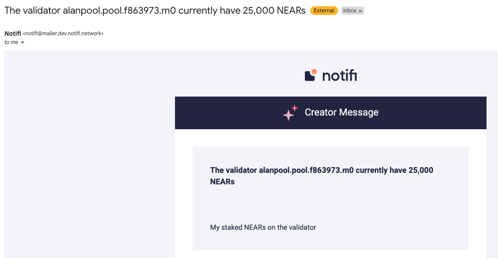

# Stake Wars: Episode III. Challenge 016

* Published on: 2022-08-29
* Updated on: 2022-08-29
* Submitted by: Meta Pool supported by Notifi Network
* Rewards: 10 Delegated NEAR Points (DNP)
  
Connect a node validator for sending notifications through [Notifi](https://notifi.network/).

Notifi Network is a notifications provider for web3. In this challenge, you will test yourself on using the Notifi API to communicate when your staking is going lower than seat price.

## Steps to complete:
* In [#integration-requests](https://discord.com/invite/nAqR3mk3rv) channel, ask to integrate a new validator on Near for Stake Wars! 
* A support ticket will be created with you in it.
* You'll be asked for your valid testnet wallet, validator name, and email where you want test messages sent.
* Once approved, a moderator will send you credentials for your account. This is the sid/secret you’ll use in the SDK to authenticate from the validator. Keep these credentials safe and never shared.
* Use the SDK sample here to broadcast messages to a particular topic. The topic name will be provided to you when you get your sid/secret pair.
https://github.com/notifi-network/notifi-sdk-ts/tree/main/packages/notifi-node-sample
* Use NotifiClient.sendBroadcastMessage to send your message via the provided topic name. For this challenge, you can leave targetTemplates as undefined, as we will use the default ones. Required variables are “subject” and “message”.

* Create an script that monitors current delegation and send information to your email through Notifi node. You can do it in bash, javascript, python or anyother you prefered.

## Acceptance criteria

An Email is sent when with validators name and current staking. 

## Proof of completion 
An screenshot showing Notifi Sending your current staking and validators name.

## Submission Form

Screenshot of your Email.

[Submit the form](https://docs.google.com/forms/d/e/1FAIpQLScp9JEtpk1Fe2P9XMaS9Gl6kl9gcGVEp3A5vPdEgxkHx3ABjg/viewform) with your distribution transactions.

## Disclaimer

This is a code provided by community, there is not knowledge of auditments or warranty on its use. Do your own review of code to ensure security and stability. Use it at your own risk.
