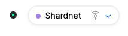
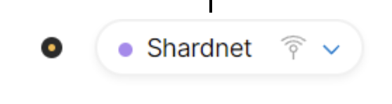

# Troubleshooting guide for Stake Wars III
* Published on: 2022-07-25
* Updated on: 2022-07-29
 
This guide is made to solve the most common questions related to a node not working as expected. Feel free to make your own contributions or suggestions on what this guide should include.

## My node is not producing chunks/blocks
Not producing means:

```
"num_expected_blocks": XXX,
"num_expected_chunks": XXX, 
"num_produced_blocks": 0,
"num_produced_chunks": 0,
```

Try this 2:

```
near view <POOL_ID> get_staking_key '{}'

cat ~/.near/validator_key.json | grep public_key
```
🗒️  **Both keys must match** . If they DO NOT update the staking pool key ❗ 

Update staking pool key:
```
near call <POOL_ID> update_staking_key '{"stake_public_key": "<PUBLIC_KEY>"}' --accountId <ACCOUNT_ID>
```

If match:
Check validator_key.json

```
cat ~/.near/validator_key.json
```

account_id must be like : xx.factory.shardnet.near
If not update it, save and stop/start neard

## Explorer is not showing my transactions/not updating - not showing my account / pool
In case that explorer.shardnet.near.org is not working, review the RPC status on the corner. 

OK (Green indicator)


RPC not available (Yellow indicator)



If it is in other color than green it should be passing unstable behavior. Wait until in stabilize.

In case you can user near CLI to review validators information.

```
near proposals
near validators current
near validators next

```

## I cannot run neard, it shows ‘Failed to open the database’
This is common because there is a current service using the files. Probably another neard service.

Try running the ***top*** command on the terminal and verify there is no *neard* service already running. 

```
top
```

In case it is already running you can verify it status using the following:

```
journalctl -n 100 -f -u neard | ccze -A
```


## My staking pool lost the tokens I delegate to it
In case you delegated tokens to your staking pools before one the hard forks made to the shardnet network, your account could be deleted by the fork.

Just create a new account and delegate enough tokens.

```
near call <staking_pool_id> deposit_and_stake --amount <amount> --accountId <accountId> --gas=300000000000000

```

## My log show: WARN telemetry: Failed to send telemetry data err=Connect(Timeout) ##

This is related to RPC issue, don't worry about it.
You will maybe have some timeout, you can use your localnode by adding ```--nodeUrl 127.0.0.1:3030```

## I want to move my node to other VPS/Cloud provider. 

Do regular steps to mount a node on the new VPS/Cloud and take in consideration this:

1. Copy over node_key.json
2. Copy over validator_key.json
4. Stop the node primary node
3. Stop the secondary node
4. Restart the secondary node


## A hardfork is announced, what should I do? (For shardnet on July 2022)

On July 27th a third hardfork was done during stake wars to Shardnet. This for upgrading core code and keep nodes with higher stability.

Run the following to upgrade:

```
sudo systemctl stop neard
rm ~/.near/data/*

cd ~/nearcore
git fetch
git checkout 68bfa84ed1455f891032434d37ccad696e91e4f5
cargo build -p neard --release --features shardnet

cd ~/.near
rm genesis.json
wget https://s3-us-west-1.amazonaws.com/build.nearprotocol.com/nearcore-deploy/shardnet/genesis.json

rm ~/.near/config.json
wget -O ~/.near/config.json https://s3-us-west-1.amazonaws.com/build.nearprotocol.com/nearcore-deploy/shardnet/config.json

sudo systemctl start neard && journalctl -n 100 -f -u neard | ccze -A
```

Also, if you owner account or staking pool doesn't appear is probably that it was removed during hard fork. Make those again.


## NEAR command worked before but now "no matching pair found"
Please always check if there is word "testnet" somewhere in the output of failing command. NEAR CLI is configured to use the "testnet" chain by default, so we need to always explicitly tell it to use "shardnet" by setting environment variable named "NEAR_ENV" (taken from Challenge 1):

```
export NEAR_ENV=shardnet
```

You can also run this command to set the Near testnet Environment persistent (so it's not lost after restart):
```
echo 'export NEAR_ENV=shardnet' >> ~/.bashrc
echo 'export NEAR_ENV=shardnet' >> ~/.bash_profile
source $HOME/.bash_profile
```

## ***Common Node Errors and Solutions*** by Open Shards Alliance
In case none of the above worked, you can use this guide. In this document you will find a general rules on how to solve problems related to a node validator running on NEAR Protocol. 

* [Common Node Errors and Solutions](https://near-nodes.io/troubleshooting/common-errors) Guide by OSA.

## Ask community

[Join official NEAR Discord server](https://discord.gg/V3Z6CsEJ7Y), where you fill find the #stakewars channel for solving questions.This is a community fueled channel, feel free to contribute.


